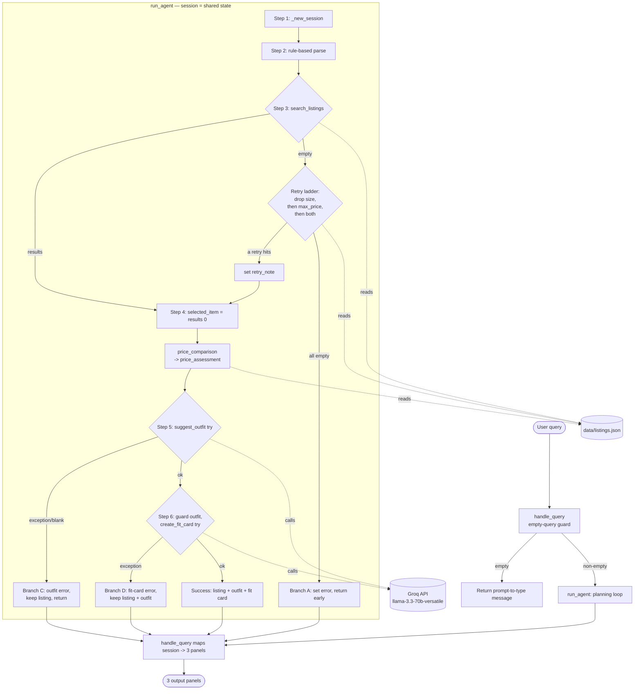

# FitFindr — planning.md

> Complete this document before writing any implementation code.
> Your spec and agent diagram are what you'll use to direct AI tools (Claude, Copilot, etc.) to generate your implementation — the more specific they are, the more useful the generated code will be.
> Your planning.md will be reviewed as part of your submission.
> Update it before starting any stretch features.

---

## Tools

Three tools, in the fixed signatures given by the starter. No additional tools
are introduced — the required scope is fully covered by these three.

```
search_listings(description, size=None, max_price=None) -> list[dict]
suggest_outfit(new_item: dict, wardrobe: dict)          -> str
create_fit_card(outfit: str, new_item: dict)            -> str
```

### Tool 1: search_listings

**What it does:**
Pure, deterministic keyword search over `data/listings.json`. **No LLM call** —
this is the one tool fully unit-testable without a Groq API key, so it is built
and tested first.

**Input parameters:**
- `description` (str): free-text keywords describing the wanted item
  (e.g. "vintage graphic tee").
- `size` (str | None): size filter, or `None` to skip size filtering.
- `max_price` (float | None): **inclusive** price ceiling, or `None` to skip.

**What it returns:**
`list[dict]` — full listing dicts, **best match first**. Each dict carries every
field from the dataset: `id, title, description, category, style_tags[], size,
condition, price (float), colors[], brand (nullable), platform`.

**Scoring (deterministic, keyword-overlap):**
1. Tokenize `description` into lowercase alphanumeric tokens (`[a-z0-9]+`).
2. Drop a small English stopword set (e.g. `a, an, the, and, or, for, with, in,
   of, to, my, me, i, is, it`). The remaining **distinct** tokens are the query
   token set.
3. For each candidate listing, build a **token bag** = lowercased whole tokens
   drawn from `title + description + style_tags + category + colors`.
4. `score` = count of **distinct** query tokens present in the bag.
5. Drop any listing with `score == 0`.
6. Sort by `score DESC`, then `price ASC`, then `id ASC` (stable, total order).

**Size matching:**
- Normalize a listing's `size` by splitting on `"/"` and whitespace into a set of
  UPPERCASE tokens. Example: `"S/M"` -> `{"S","M"}`; `"W30 L30"` -> `{"W30","L30"}`;
  `"US 7"` -> `{"US","7"}`.
- A **letter** size (`XS/S/M/L/XL/XXL`) matches iff it equals one of those tokens,
  so `"M"` matches `"S/M"`.
- A **numeric** size matches iff present as a whole token.
- Explicit guard: `size="s"` must **NOT** match `"US 7"` and must **NOT** match
  `"W28"` — the size token must equal a full normalized token, never a substring
  inside `"US"`, `"W28"`, etc.

**Edge case (price/size only, no usable description tokens):**
If `description` yields zero usable tokens after stopword removal, but a `size`
and/or `max_price` filter was supplied, **skip scoring entirely** and return all
listings that pass the price/size filters (sorted `price ASC`, then `id ASC`).

**What happens if it fails or returns nothing:**
Returns `[]` when nothing matches. **Never raises.** The planning loop turns an
empty result into a friendly error and stops before the LLM tools.

---

### Tool 2: suggest_outfit

**What it does:**
Uses **Groq** model `llama-3.3-70b-versatile` via the shared `_get_groq_client()`
helper to suggest outfits built around the found item and the user's wardrobe.

**Input parameters:**
- `new_item` (dict): the listing the user is considering (the search winner).
- `wardrobe` (dict): shape `{"items": [...]}`; the list **may be empty**.

**What it returns:**
A non-empty `str`.
- **Non-empty wardrobe** -> 1–2 outfits that name **specific** wardrobe pieces
  alongside `new_item`.
- **Empty wardrobe** -> general styling advice for `new_item` (what pairs well,
  what vibe it suits).

**What happens if it fails or returns nothing:**
An empty wardrobe is **NOT an error** — that branch still calls the LLM. The
function **never constructs an empty return** itself; the empty-wardrobe branch
issues a real LLM call and returns its text. An empty/blank return can only come
from an upstream LLM failure, which the planning loop catches (Step 5). Unit
tests mock `_get_groq_client()` and assert the empty-wardrobe branch still calls
the client.

---

### Tool 3: create_fit_card

**What it does:**
Uses **Groq** at a **higher temperature** than `suggest_outfit` so captions vary
across runs and inputs. Produces a casual, share-ready OOTD caption.

**Input parameters:**
- `outfit` (str): the outfit text produced by `suggest_outfit()`.
- `new_item` (dict): the listing dict.

**What it returns:**
A **2–4 sentence** casual, authentic caption that mentions the item `title`,
`price`, and `platform` **once each**, naturally — not a product description.

**What happens if it fails or returns nothing:**
A module-level constant `FIT_CARD_NO_OUTFIT_MSG` is **returned** (never raised)
when `outfit` is empty or whitespace-only. In practice the planning loop guards
`outfit_suggestion` before calling this tool, so the sentinel is primarily the
tool's **own unit-test concern** — a direct call with `outfit=""` returns
`FIT_CARD_NO_OUTFIT_MSG`.

---

### Additional Tools (if any)

**Tool 4: `price_comparison(item: dict) -> str`** *(stretch feature — pure Python, no LLM, no API key)*

**What it does:**
Tells the shopper whether a found listing's price is good relative to comparable
items. Pure and deterministic, like Tool 1 — **no LLM call**, fully unit-testable
without a key. Loads the dataset with `load_listings()` and compares the item's
price against listings in the **same `category`**, excluding the item itself.

**Input parameters:**
- `item` (dict): a listing dict (typically the search winner / `selected_item`).
  Must have `category`, `id`, and `price`; `price` may be missing/`None`.

**Comparables:**
All listings whose `category` equals `item["category"]`, **excluding** the item
itself (matched by `id`). If fewer than **2** comparables exist, the function
returns a graceful sentence and does no math.

**What it returns (one readable sentence):**
Computes the comparables' price **min, max, and median**, then compares
`item["price"]` to the median:
- `<= 0.85 * median` → verdict **"a great deal"**.
- within `0.85*median .. 1.15*median` (inclusive) → **"fairly priced"**.
- `> 1.15 * median` → **"priced above comparable items"**.

The returned sentence states the verdict **and** the reasoning (the item price,
the comparable count and category noun, and the comparables' range + median),
e.g.: *"Fairly priced — at $24.00 it's in line with the 14 comparable tops
(range $15.00–$35.00, median $21.00)."*

**What happens if it fails or returns nothing:**
- Fewer than 2 comparables → `"Not enough comparable listings to assess this price."`
- Missing/`None` price, or an unreadable dataset → a graceful sentence; the
  function **never raises**.

---

## Planning Loop

The loop lives in `run_agent(query, wardrobe)` in `agent.py` and runs the seven
steps below. The session dict (see State Management) is the only thing written.

**Step 1 — Initialize.** `session = _new_session(query, wardrobe)`.

**Step 2 — Parse the query (RULE-BASED, deliberate choice).**
Rule-based parsing is chosen over an LLM parse because it is **deterministic,
free (no API call), and testable without a key** — the same reasons Tool 1 is
rule-based. Result stored in `session["parsed"]` as
`{"description", "size", "max_price"}`.
- **Description:** take the query text *before* the first wardrobe/styling cue
  (case-insensitive): `"i wear"`, `"i mostly wear"`, `"i usually wear"`,
  `"i have"`, `"i own"`, `"how would i style"`, `"how do i"`,
  `"what's out there"`, `"what is out there"`, `"style it"`. Then strip the
  matched price + size phrases from that text. If the result is empty, fall back
  to the **full query** with price/size phrases stripped.
- **`max_price` patterns** (first match wins): `"$NN(.NN)?"`, `"under $?NN"`,
  `"below $?NN"`, `"less than $?NN"`, `"max $?NN"`. A bare `"$NN"` is the ceiling.
  No match -> `None`.
- **`size` patterns:** prefer a `"size X"` token (letter or number) if present;
  else a standalone **whole-word** token (word boundaries) from
  `{XS, S, M, L, XL, XXL}`, uppercased. Never match a letter **inside** a word
  (the `s` in "jeans" is not size `S`).

**Step 3 — Search, with a retry ladder (stretch feature).**
`search_listings(**session["parsed"])` -> `session["search_results"]`. If the
result is empty, **retry by progressively relaxing only the filters that were
actually set**, taking the first retry that yields results:
1. **drop the size filter** (keep description + max_price),
2. **drop the max_price filter** (keep description + size),
3. **drop both** size and max_price (keep description only).

A relaxation step is only attempted when it would actually change the query
(i.e. the filter it drops was set). When a retry succeeds, record a
human-readable `session["retry_note"]` describing exactly what was relaxed, e.g.
*"No exact matches for size M under $30 — I relaxed the size filter and searched
again."* `retry_note` is set **only** when a retry actually returned results.
If even the description-only search is empty (true no-results): set
`session["error"]` (the same friendly message as before) and **return early** —
do **not** call `suggest_outfit`. The early-return-on-true-no-results contract is
preserved.

**Step 4 — Select.** `session["selected_item"] = session["search_results"][0]`
(the top-ranked listing). Then call `price_comparison(selected_item)` (Tool 4,
pure Python, never raises) and store the sentence in
`session["price_assessment"]`.

**Step 5 — Suggest outfit.** Call `suggest_outfit(selected_item, wardrobe)` in a
`try`. Empty wardrobe is fine (general advice). On exception *or* a blank return:
set `session["error"] = "I found a great piece for you, but I couldn't generate
outfit ideas right now — here's the listing. Try again in a moment."`, **keep**
`selected_item`, and return early. Otherwise store `session["outfit_suggestion"]`.

**Step 6 — Fit card.** **Guard** that `outfit_suggestion` is non-empty, then call
`create_fit_card(outfit_suggestion, selected_item)` in a `try`. On exception: set
`session["error"] = "Your outfit idea is ready, but I couldn't write the
shareable fit card this time. Here are the listing and styling notes — copy them
straight to your post or hit Find it again."`, but **keep** both
`outfit_suggestion` and `selected_item`. Otherwise store `session["fit_card"]`.

**Step 7 — Return.** Return `session`.

> Raw exceptions are logged to **stderr** for debugging; the user only ever sees
> the friendly `session["error"]` strings above.

---

## State Management

The `session` dict from `_new_session()` is the **single source of truth** for
one interaction. **`run_agent` is the only writer**; the three tools are pure
functions that read their arguments and return values. The search winner
(`selected_item = search_results[0]`) is threaded into **both** LLM tools, and
`outfit_suggestion` flows from Tool 2 into Tool 3.

### Field read/write table

| Field               | Written by              | Read by                                    |
|---------------------|-------------------------|--------------------------------------------|
| `query`             | `_new_session` (Step 1) | Step 2 (parse)                             |
| `parsed`            | Step 2                  | Step 3 (search args), Step 3 error message |
| `search_results`    | Step 3 (incl. retries)  | Step 4 (select)                            |
| `selected_item`     | Step 4                  | Step 5 + Step 6 (into both LLM tools), app |
| `wardrobe`          | `_new_session` (Step 1) | Step 5 (suggest_outfit)                    |
| `outfit_suggestion` | Step 5                  | Step 6 (guard + create_fit_card), app      |
| `fit_card`          | Step 6                  | app (panel 3)                              |
| `error`             | Steps 3 / 5 / 6         | app (decides panel mapping)                |
| `retry_note`        | Step 3 (on retry win)   | app (prepends 🔁 line to panel 1)          |
| `price_assessment`  | Step 4                  | app (appends 💰 line to panel 1)           |

### Partial-success panel mapping

The Gradio UI has three panels: panel 1 = listing, panel 2 = outfit idea,
panel 3 = fit card. `handle_query` maps the session to panels so that **partial
results are preserved** even when a later step fails:

| Case                | Panel 1      | Panel 2 | Panel 3  |
|---------------------|--------------|---------|----------|
| (a) search failed   | `error`      | `""`    | `""`     |
| (b) outfit failed   | listing text | `error` | `""`     |
| (c) fit card failed | listing text | outfit  | `error`  |
| (d) success         | listing text | outfit  | fit card |

> This **intentionally improves on the stub's** "error in panel 1, blank panels
> 2/3" behavior: by keeping `selected_item` and `outfit_suggestion` in the
> session on later failures, the user never loses a good listing or a good
> outfit just because the *next* step hiccuped.

---

## Error Handling

For each tool, describe the specific failure mode you're handling and what the agent does in response.

| Tool | Failure mode | Agent response |
|------|-------------|----------------|
| search_listings | No results match the query | **Attempt the retry ladder first** (Step 3, stretch feature): relax size, then max_price, then both, taking the first retry that yields results and recording `session["retry_note"]`. Only if every relaxation is still empty (**true** no-results) set `session["error"]` echoing the parsed description and **return early** (no `suggest_outfit`). The tool itself returns `[]`, never raises. |
| price_comparison | Fewer than 2 comparables, or missing/`None` price | Returns a graceful sentence (never raises). The loop stores it in `session["price_assessment"]`; it never blocks the outfit/fit-card steps. |
| suggest_outfit | Wardrobe is empty | **NOT an error.** The empty-wardrobe branch calls the LLM for general styling advice and returns it. Only a genuine LLM exception/blank return becomes the Step-5 error: *"I found a great piece for you, but I couldn't generate outfit ideas right now — here's the listing. Try again in a moment."* |
| create_fit_card | Outfit input is missing or incomplete | Tool returns the module-level sentinel `FIT_CARD_NO_OUTFIT_MSG` — **no raise**. In the loop, Step 6 guards `outfit_suggestion` first; a true LLM exception sets the Step-6 error while keeping the listing + outfit. |

All caught exceptions are logged to **stderr**; users only see the friendly
strings above.

---

## Architecture



---

## Stretch Features

Two stretch features are implemented (planning.md was updated before each):

1. **Retry Logic with Fallback** (`run_agent`, Step 3). When the initial search is
   empty, the loop progressively relaxes only the filters that were set — drop
   size, then drop max_price, then drop both — taking the first relaxation that
   yields results and telling the user what was relaxed via `session["retry_note"]`.
   A truly impossible query still hits the original hard no-results error and
   returns early before any LLM call.

2. **Price Comparison Tool** (`price_comparison`, Tool 4). A 4th pure-Python tool
   that, after selection, compares the chosen listing's price to the median of
   same-category comparables and returns a one-sentence verdict ("a great deal",
   "fairly priced", or "priced above comparable items") with its reasoning, stored
   in `session["price_assessment"]`. Both results enrich panel 1 in the UI without
   any layout change.

---

## AI Tool Plan

How AI assistance is used to build each piece, what it is given, what it should
produce, and how the output is verified before moving on.

**Milestone 3 — Individual tool implementations:**

| Tool | planning.md sections given to AI | Expected output | How I verify before trusting it |
|------|----------------------------------|-----------------|---------------------------------|
| `search_listings` | "Tool 1" (scoring, size matching, edge case) | Pure function using `load_listings()`: tokenize, score, filter, sort; returns full dicts, `[]` on miss. | Tested against **real queries** on `listings.json`: "vintage graphic tee under $30" -> `lst_002`; `size="s"` does not match `"US 7"`/`"W28"`; `"M"` matches `"S/M"`; empty result -> `[]`. |
| `suggest_outfit` | "Tool 2" | LLM call via `_get_groq_client()`; branch on empty vs non-empty wardrobe. | **Mocked Groq client**: assert the empty-wardrobe branch still calls the client and returns its text; non-empty branch includes wardrobe pieces in the prompt. |
| `create_fit_card` | "Tool 3" | Higher-temperature LLM call; `FIT_CARD_NO_OUTFIT_MSG` sentinel for empty outfit. | **Mocked client** for the happy path (caption returned); a direct call with `outfit=""` returns the sentinel without raising. |

**Milestone 4 — Planning loop and state management:**

| Piece | planning.md sections given to AI | How I verify |
|-------|----------------------------------|--------------|
| `run_agent` loop | "Planning Loop", "State Management", "Error Handling" | Run `python agent.py` `__main__`: **happy path** ("vintage graphic tee under $30") yields listing + outfit + fit card; **no-results path** ("designer ballgown size XXS under $5") sets a friendly error and stops before `suggest_outfit`. Branch tests with a **mocked client** force Step-5 and Step-6 failures and assert partials are kept. |
| `handle_query` (app) | "State Management" (panel mapping), "Error Handling" | Empty-query guard returns a prompt-to-type message; session-to-panel mapping matches cases (a)–(d); manual smoke test in the Gradio UI on the example queries. |

---

## A Complete Interaction (Step by Step)

Write out what a full user interaction looks like from start to finish — tool call by tool call. Use a specific example query.

**Example user query:** "vintage graphic tee under $30"

> **Cost / limits note.** A *successful* run makes **two sequential Groq calls**:
> first `suggest_outfit`, then `create_fit_card` at a higher temperature. A
> per-request timeout is set on the client; there is **no automatic retry** in
> v1 (the user can press "Find it" again). Search itself is free and local.

**Step 1 — Parse (rule-based).**
`parsed = {"description": "vintage graphic tee", "max_price": 30.0, "size": None}`
— `"under $30"` matches the price pattern and is stripped from the description;
no size token is present.

**Step 2 — Search + select.**
Query token set `{vintage, graphic, tee}`. Among listings priced `<= $30`, three
score 3: `lst_002` ($18, "Y2K Baby Tee — Butterfly Print" — *tee/graphic/vintage*
all hit via `style_tags`), `lst_033` ($19), and `lst_006` ($24). The `price ASC`
tie-break makes **`lst_002` the winner**, so
`selected_item = lst_002` — "Y2K Baby Tee — Butterfly Print", **$18.00**, on
**depop**. *(Confirmed by replaying the scoring rules against the dataset.)*

**Step 3 — Suggest outfit, then fit card.**
With the example wardrobe, `suggest_outfit` returns a plausible 1–2 outfit
suggestion naming specific pieces, e.g. *"Tuck the butterfly baby tee into your
baggy dark-wash straight-leg jeans, throw the vintage black denim jacket over the
top, and finish with the chunky white sneakers and the black crossbody bag for an
easy Y2K-leaning everyday look."* `create_fit_card` then turns that into a casual
2–4 sentence caption mentioning the title, $18, and depop once each.

**Final output to user (the three panels):**
- **Panel 1 — Top listing found:** `Y2K Baby Tee — Butterfly Print` · tops ·
  size S/M · excellent · **$18.00** · depop — "Super cute early 2000s baby tee
  with butterfly graphic. Fitted crop length. Tag says medium but fits like a
  small."
- **Panel 2 — Outfit idea:** the `suggest_outfit` text above (specific wardrobe
  pieces + the new tee).
- **Panel 3 — Your fit card:** the casual share-ready caption from
  `create_fit_card`, naming the tee, $18, and depop.
